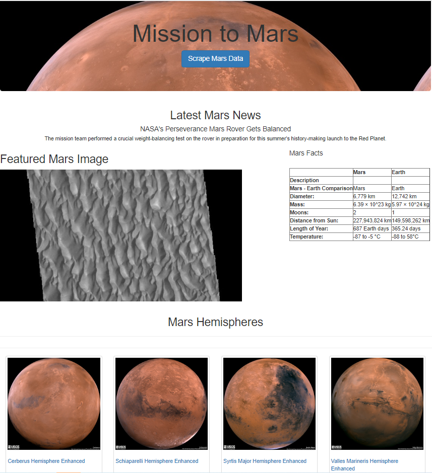

# Mission-to-Mars

## Overview

The purpose of this repository is to generate a landing page from scraped data about Mars.

## Resources
### Websites
    - 'https://redplanetscience.com'
    - 'https://spaceimages-mars.com'
    - 'https://galaxyfacts-mars.com'
    - 'https://astrogeology.usgs.gov'

### Tools
    - Visual Studio Code
    - Python 3.7.10 | Libraries Used: Flask, Splinter, Beautiful Soup, Pandas, webdriver_manager.chrome
    - Jupyter Notebook
    - MongoDB

## Results

